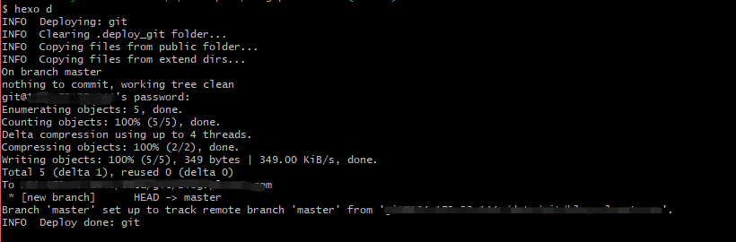

### 服务器搭建

### 服务器准备信息

#### 购买云主机

完成搭建的前提是, 你需要有一个属于自己的与主机, 你可以选择购买阿里云或者腾讯云, 毕竟国内云主机做的比较好的, 学生购买还是很优惠的

#### 相关软件安装

这里推荐使用 [ezhttp 工具](https://www.centos.bz/2017/02/ezhttp/) 来进行服务器环境的安装, 他的简介是这样的: 

ezhttp是一个[Linux](https://www.centos.bz/tag/linux/)一键配置工具，采用bash脚本语言编写。支持自动配置LAMP,LNMP,[LNAMP](https://www.centos.bz/tag/lnamp/)环境，以前提供各种其它的配置工具，如自动配置swap,配置iptables等。项目托管在github，地址为<https://github.com/centos-bz/ezhttp>。

#### 配置nginx服务器

安装完成之后, 你需要为你的站点配置域名, 指定一个站点目录. 

找到`nginx`配置文件, 假定你安装在`/usr/local/nginx`

```shell
> cd /user/local/nginx/conf
> cd vhost
> touch myblog.conf
```

写入以下内容, 修改包含注释的位置为你的实际内容即可

```

server {
        listen 80;
        # 网站的IP地址
        server_name blog.plcent.com;
        index index.html index.php index.htm;
        # 指定的站点目录
        root /home/website/myblog;

        location / {
            try_files $uri $uri/index.html @apache;
        }

        location @apache {
            internal;
            proxy_pass http://127.0.0.1:88;
            include proxy.conf;
        }

        location ~ .*\.(php|php5)?$ {
             proxy_pass http://127.0.0.1:88;
             include proxy.conf;
        }

```

> 你可以为内一个站点配置一个文件

重启服务器, 使得新配置生效

```shell
> /etc/init.d/nginx restart
```


#### 建立git账号

你需要在服务器上建立一个`git`账号, 用来推送仓库使用(因为使用`root`账号并不是很安全)

```shell
# 添加git用户
> useradd git
# 为用户设置密码
> passwd git
# 为了安全, 只为git用户配置git shell
> usermod -s /bin/git-shell git
```

#### 建立空仓库

```shell
# 进入自己的git仓库
> cd /data/gitstore
# 初始化一个空仓库
> git init --bare myblog.git
```

#### 仓库修改权限

正常情况下, 你建立仓库时是使用`root`账号创立的, `git`用户无权操作该目录, 你需要将该仓库的操作权限交给`git`

```shell
>  chown -R git:git myblog.git
```

> `-R` 一定要添加, 该属性将递归修改所有文件的权限

#### hexo 配置推送仓库

在hexo根目录的 `_config.yml` 中配置:

```yml
# Deployment
## Docs: https://hexo.io/docs/deployment.html
deploy:
  type: git
  repo: git@your_server_IP:/data/gitstore/myblog
  branch: master
```

> 替换`your_server_IP`为你服务器实际的IP地址
>
> 替换`/data/gitstore/myblog`为你git仓库的实际路径

#### hexo d 推送仓库到自己服务器

在使用`hexo d` 命令推送编译好的博客内容到仓库时, 你需要在本地先安装

```
> npm install hexo-deployer-git --save
```

安装完成之后, 使用 `hexo d` 推送试试, 推送成功将显示:




查看上面的截图你会发现这里是使用用户名密码的方式推送仓库, 为了更方便使用可以配置使用ssh登录

#### 配置ssh

[设置 SSH Key 登录服务器和 Git 服务器](https://www.cnblogs.com/feiffy/p/8995003.html)


### 让服务器git自动部署博客

自动部署的原理就是利用`git`钩子`post-receive`在仓库被提交之后执行钩子中定义的命令

```shell
# 进入git仓库hooks目录
> cd /data/gitstore/myblog.git/hooks
# 如果没有post-receive文件则新建
> touch post-receive
# 写入内容
> vi post-receive
```

```
#!/bin/bash
#指定我的代码检出目录
DIR=/home/wwwroot/myblog
git --work-tree=${DIR} clean -fd
#直接强制检出
git --work-tree=${DIR} checkout --force
```

> 修改`/home/wwwroot/myblog`为你网站实际部署的地址

修改钩子文件执行权限

```
# 为钩子文件添加可执行权限
> chmod 766 post-receive
# 重新刷一遍仓库权限
> cd ../../
> chown -R git:git myblog.git
```

#### 推送博客

```
> hexo clean
> hexo g
> hexo d
```


### 参考文档

[Linux一键配置工具ezhttp介绍](https://www.centos.bz/2017/02/ezhttp/)

[ezhttp一键安装配置lnmp lamp lnamp(nginx apache php mysql)环境](https://www.centos.bz/2017/02/ezhttp-lamp-lnmp-lanmp-nginx-php-mysql/)

[带你跳过各种坑，一次性把 Hexo 博客部署到自己的服务器](<https://blog.csdn.net/qq_35561857/article/details/81590953>)

[git仓库推送报错: insufficient permission for adding an object to repository database ./objects 的解决办法](<https://blog.csdn.net/sungdut/article/details/46129711>)


