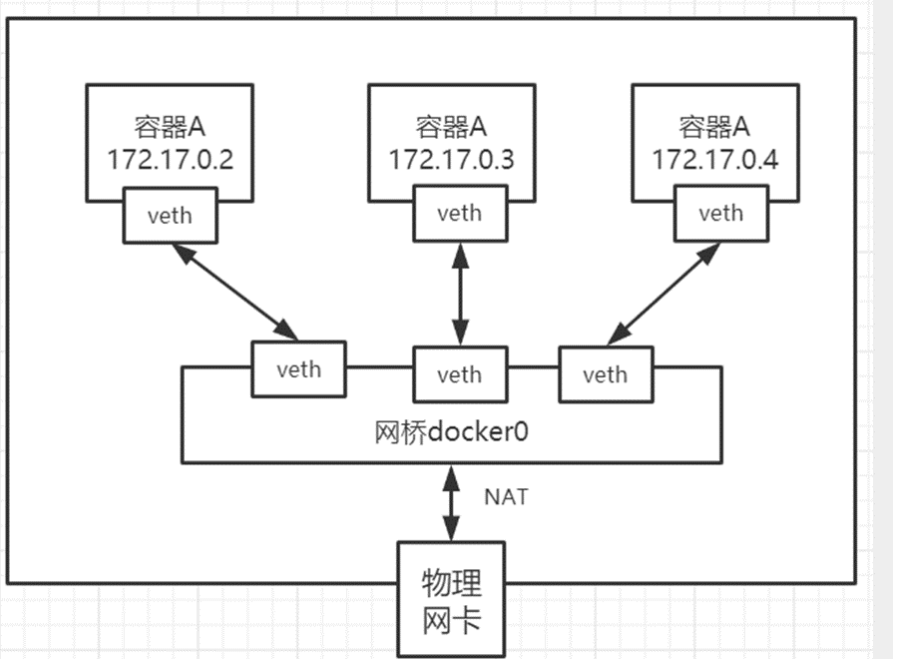
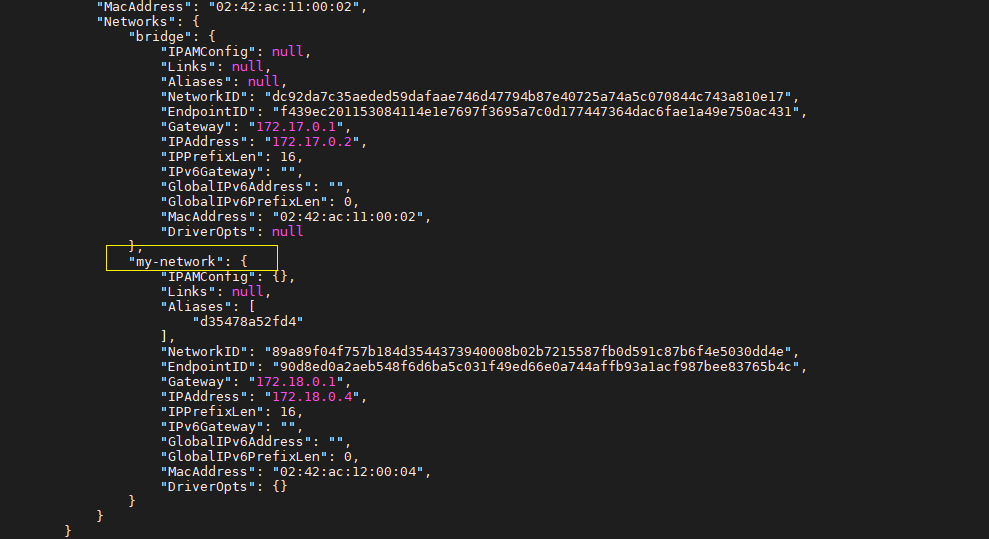

# docker网络互连


## docker0网络

在未启动任何docker镜像时，查看本机的网卡，存在docker0

```
# 查看本机网络情况
[root@VM-16-13-centos ~]# ip addr
1: lo: <LOOPBACK,UP,LOWER_UP> mtu 65536 qdisc noqueue state UNKNOWN group default qlen 1000
    link/loopback 00:00:00:00:00:00 brd 00:00:00:00:00:00
    inet 127.0.0.1/8 scope host lo
       valid_lft forever preferred_lft forever
    inet6 ::1/128 scope host
       valid_lft forever preferred_lft forever
2: eth0: <BROADCAST,MULTICAST,UP,LOWER_UP> mtu 1500 qdisc mq state UP group default qlen 1000
    link/ether 55:54:00:a7:16:17 brd ff:ff:ff:ff:ff:ff
    inet 11.0.16.13/22 brd 10.0.19.255 scope global noprefixroute eth0
       valid_lft forever preferred_lft forever
    inet6 fe80::5054:ff:fea7:1617/64 scope link noprefixroute
       valid_lft forever preferred_lft forever
3: docker0: <BROADCAST,MULTICAST,UP,LOWER_UP> mtu 1500 qdisc noqueue state UP group default
    link/ether 02:42:dc:a8:a2:72 brd ff:ff:ff:ff:ff:ff
    inet 172.17.0.1/16 brd 172.17.255.255 scope global docker0
       valid_lft forever preferred_lft forever
    inet6 fe80::42:dcff:fea8:a272/64 scope link
       valid_lft forever preferred_lft forever

```

启动两容器

```
# 启动一个nginx容器
docker run -it --name ng1 nginx
# 查看容器的IP地址
docker inspect -f '{{range .NetworkSettings.Networks}}{{.IPAddress}}{{end}}' ng1
172.17.0.2


# 启动一个tomcat容器
docker run -it --name tomcat01 tomcat
# 查看容器的IP地址
docker inspect -f '{{range .NetworkSettings.Networks}}{{.IPAddress}}{{end}}' ng1
172.17.0.3
```

启动两个容器后，本机网卡多个两个内容

```
# 查看本机网络情况
ip addr
1: lo: <LOOPBACK,UP,LOWER_UP> mtu 65536 qdisc noqueue state UNKNOWN group default qlen 1000
    link/loopback 00:00:00:00:00:00 brd 00:00:00:00:00:00
    inet 127.0.0.1/8 scope host lo
       valid_lft forever preferred_lft forever
    inet6 ::1/128 scope host
       valid_lft forever preferred_lft forever
2: eth0: <BROADCAST,MULTICAST,UP,LOWER_UP> mtu 1500 qdisc mq state UP group default qlen 1000
    link/ether 55:54:00:a7:16:17 brd ff:ff:ff:ff:ff:ff
    inet 11.0.16.13/22 brd 10.0.19.255 scope global noprefixroute eth0
       valid_lft forever preferred_lft forever
    inet6 fe80::5054:ff:fea7:1617/64 scope link noprefixroute
       valid_lft forever preferred_lft forever
3: docker0: <BROADCAST,MULTICAST,UP,LOWER_UP> mtu 1500 qdisc noqueue state UP group default
    link/ether 02:42:dc:a8:a2:72 brd ff:ff:ff:ff:ff:ff
    inet 172.17.0.1/16 brd 172.17.255.255 scope global docker0
       valid_lft forever preferred_lft forever
    inet6 fe80::42:dcff:fea8:a272/64 scope link
       valid_lft forever preferred_lft forever
99: veth5bc12fa@if98: <BROADCAST,MULTICAST,UP,LOWER_UP> mtu 1500 qdisc noqueue master docker0 state UP group default
    link/ether 56:27:a0:23:a0:f7 brd ff:ff:ff:ff:ff:ff link-netnsid 0
    inet6 fe80::5427:a0ff:fe23:a0f7/64 scope link
       valid_lft forever preferred_lft forever
101: veth7ede5f7@if100: <BROADCAST,MULTICAST,UP,LOWER_UP> mtu 1500 qdisc noqueue master docker0 state UP group default
    link/ether 22:3b:ed:fc:47:29 brd ff:ff:ff:ff:ff:ff link-netnsid 1
    inet6 fe80::203b:edff:fefc:4729/64 scope link
       valid_lft forever preferred_lft forever

```

从主机检查网络情况，可以直接ping通docker内部的网络

```
[root@VM-16-13-centos ~]# ping 172.17.0.2
PING 172.17.0.2 (172.17.0.2) 56(84) bytes of data.
64 bytes from 172.17.0.2: icmp_seq=1 ttl=64 time=0.037 ms
--- 172.17.0.2 ping statistics ---
2 packets transmitted, 2 received, 0% packet loss, time 1053ms
rtt min/avg/max/mdev = 0.037/0.038/0.039/0.001 ms

[root@VM-16-13-centos ~]# ping 172.17.0.3
PING 172.17.0.3 (172.17.0.3) 56(84) bytes of data.
64 bytes from 172.17.0.3: icmp_seq=1 ttl=64 time=0.045 ms
--- 172.17.0.3 ping statistics ---
4 packets transmitted, 4 received, 0% packet loss, time 3079ms
rtt min/avg/max/mdev = 0.040/0.042/0.045/0.006 ms
```

容器ng1中启动了默认的nginx站点，可以通过IP直接请求到

```
curl http://172.17.0.2

<!DOCTYPE html>
<html>
<head>
<title>Welcome to nginx!</title>
<style>
html { color-scheme: light dark; }
body { width: 35em; margin: 0 auto;
font-family: Tahoma, Verdana, Arial, sans-serif; }
</style>
</head>
<body>
<h1>Welcome to nginx!</h1>
<p>If you see this page, the nginx web server is successfully installed and
working. Further configuration is required.</p>

<p>For online documentation and support please refer to
<a href="http://nginx.org/">nginx.org</a>.<br/>
Commercial support is available at
<a href="http://nginx.com/">nginx.com</a>.</p>

<p><em>Thank you for using nginx.</em></p>
</body>
</html>
```

## docker是如何进行网络通信的?

 **每一个安装了Docker的linux主机都有一个docker0的虚拟网卡。这是个桥接网卡，使用了veth-pair技术！** 


查看本机网卡发现，每启动一个docker容器，则会生成一个新的网卡信息，网卡信息都是一对一对存在的。

启动容器均会生成新的网卡信息，删除容器，网卡也会移除，也就是每次启动，IP地址都会新建




Docker容器网络就很好的利用了Linux虚拟网络技术，在本地主机和容器内分别创建一个虚拟接口，并 让他们彼此联通（这样一对接口叫veth pair）；
Docker中的网络接口默认都是虚拟的接口。虚拟接口的优势就是转发效率极高（因为Linux是在内核中 进行数据的复制来实现虚拟接口之间的数据转发，无需通过外部的网络设备交换），对于本地系统和容 器系统来说，虚拟接口跟一个正常的以太网卡相比并没有区别，只是他的速度快很多。


## veth-pair

[Linux veth pair 详解](https://zhuanlan.zhihu.com/p/293659939)

veth pair是成对出现的一种虚拟网络设备接口，一端连着网络协议栈，一端彼此相连。


Veth-pair 不是一个设备，而是一对设备，作为虚拟网线用于连接两个虚拟网络设备。veth pair 是根据[数据链路层](https://so.csdn.net/so/search?q=数据链路层&spm=1001.2101.3001.7020)的 MAC 地址对网络数据包进行转发的过程来实现的，本质是反转通讯数据的方向，需要发送的数据会被转换成需要收到的数据重新送入内核网络层进行处理，从而间接的完成数据的注入。 


## 容器互联 --link

```
# 启动新的容器 ng2 并将它和 ng1 的网络连通
docker run -d -P -it --name ng2 --link ng1 nginx

# 即可在容器 ng2 中，直接通过容器名连通容器 ng1
docker exec -it ng2 curl http://ng1
<!DOCTYPE html>
<html>
<head>
<title>Welcome to nginx!</title>
<style>
html { color-scheme: light dark; }
body { width: 35em; margin: 0 auto;
font-family: Tahoma, Verdana, Arial, sans-serif; }
</style>
</head>
<body>
<h1>Welcome to nginx!</h1>
<p>If you see this page, the nginx web server is successfully installed and
working. Further configuration is required.</p>

<p>For online documentation and support please refer to
<a href="http://nginx.org/">nginx.org</a>.<br/>
Commercial support is available at
<a href="http://nginx.com/">nginx.com</a>.</p>

<p><em>Thank you for using nginx.</em></p>
</body>
</html>


# 但是反过来，却不可以，网络不通
docker exec -it ng1 curl http://ng2
```

其根本原因在于使用--link命令时，其实是在容器的/etc/hosts中配置了相关的域名映射关系。

```
# 查看ng2容器的hosts配置
# 发现新增了到ng1的域名配置信息
docker exec -it ng2 cat /etc/hosts

127.0.0.1       localhost
::1     localhost ip6-localhost ip6-loopback
fe00::0 ip6-localnet
ff00::0 ip6-mcastprefix
ff02::1 ip6-allnodes
ff02::2 ip6-allrouters
# 该配置信息，让ng2内部可以直接通过ng1请求172.17.0.2
172.17.0.2      ng1 d35478a52fd4
172.17.0.4      7e5024e74b30


# 查看ng1容器的hosts配置
# ng1 中未配置 ng2 的信息，所以无法直接访问
docker exec -it ng1 cat /etc/hosts

127.0.0.1       localhost
::1     localhost ip6-localhost ip6-loopback
fe00::0 ip6-localnet
ff00::0 ip6-mcastprefix
ff02::1 ip6-allnodes
ff02::2 ip6-allrouters
172.17.0.2      d35478a52fd4

```


> 该种方式相对死板，不够灵活，所以 --link 方式已经不建议使用。更为灵活的方式是自定义docker网络


## 自定义网络docker network create

docker0存在不能通过域名的方式访问、可以通过--link连通但是不够灵活。

docker提供的网络模式

- bridge 桥接模式
- none 不配置网络
- host 主机模式
- 

```

# 你可以自定义一个桥接网络, 默认情况下,会根据docker0的IP自动生成
docker network create -d bridge my-network

docker network inspect my-network
[
    {
        "Name": "my-network",
        "Id": "89a89f04f757b184d3544373940008b02b7215587fb0d591c87b6f4e5030dd4e",
        "Created": "2022-07-15T18:19:46.645909571+08:00",
        "Scope": "local",
        "Driver": "bridge",
        "EnableIPv6": false,
        "IPAM": {
            "Driver": "default",
            "Options": {},
            "Config": [
                {
                    "Subnet": "172.18.0.0/16",
                    "Gateway": "172.18.0.1"
                }
            ]
        },
        "Internal": false,
        "Attachable": false,
        "Ingress": false,
        "ConfigFrom": {
            "Network": ""
        },
        "ConfigOnly": false,
        "Containers": {},
        "Options": {},
        "Labels": {}
    }
]


# 当然可以自己指定子网IP和网关。指定子网IP需要指定网关IP，默认都是x.x.0.1
docker network create -d bridge --subnet=192.168.0.0/16 --getway 192.168.0.1 my-network2
```

## 使用自定义网络 --net

启动容器时，使用--net参数指定网络，如果不指定该参数，则默认使用docker0作为网络。

```
# 启动my-ng1容器
[root@VM-16-13-centos ~]# docker run -d -it --name my-ng1 --net my-network nginx
WARNING: IPv4 forwarding is disabled. Networking will not work.
fb9f6921bd53a4522e20b84d35447eaabe316cba9cd9c7cda6faa362b2047d64

# 启动my-ng2容器
[root@VM-16-13-centos ~]# docker run -d -it --name my-ng2 --net my-network nginx
WARNING: IPv4 forwarding is disabled. Networking will not work.
71ffcb0a619d81cd36c3283419da543bd23a721d4e84801b877891a5be1d614a

# 查看新建网络的情况，发现新建的两个容器已经挂载在新建的网络上
[root@VM-16-13-centos ~]# docker network inspect my-network
[
    {
        "Name": "my-network",
        "Id": "89a89f04f757b184d3544373940008b02b7215587fb0d591c87b6f4e5030dd4e",
        "Created": "2022-07-15T18:19:46.645909571+08:00",
        "Scope": "local",
        "Driver": "bridge",
        "EnableIPv6": false,
        "IPAM": {
            "Driver": "default",
            "Options": {},
            "Config": [
                {
                    "Subnet": "172.18.0.0/16",
                    "Gateway": "172.18.0.1"
                }
            ]
        },
        "Internal": false,
        "Attachable": false,
        "Ingress": false,
        "ConfigFrom": {
            "Network": ""
        },
        "ConfigOnly": false,
        "Containers": {
            "71ffcb0a619d81cd36c3283419da543bd23a721d4e84801b877891a5be1d614a": {
                "Name": "my-ng2",
                "EndpointID": "5e3c6239a7bf550a97963466b74e8829f1523af6d6985b8b46e0da5b74f11332",
                "MacAddress": "02:42:ac:12:00:03",
                "IPv4Address": "172.18.0.3/16",
                "IPv6Address": ""
            },
            "fb9f6921bd53a4522e20b84d35447eaabe316cba9cd9c7cda6faa362b2047d64": {
                "Name": "my-ng1",
                "EndpointID": "f450e8f8f9ea96aaed2c55e0db93f1cd8962ea9998b3500ca4307f419a76aade",
                "MacAddress": "02:42:ac:12:00:02",
                "IPv4Address": "172.18.0.2/16",
                "IPv6Address": ""
            }
        },
        "Options": {},
        "Labels": {}
    }
]

# 直接在 my-ng1 容器中，使用容器名称，请求 my-ng2 容器
[root@VM-16-13-centos ~]# docker exec -it my-ng1 curl http://my-ng2
<!DOCTYPE html>
<html>
<head>
<title>Welcome to nginx!</title>
<style>
html { color-scheme: light dark; }
body { width: 35em; margin: 0 auto;
font-family: Tahoma, Verdana, Arial, sans-serif; }
</style>
</head>
<body>
<h1>Welcome to nginx!</h1>
<p>If you see this page, the nginx web server is successfully installed and
working. Further configuration is required.</p>

<p>For online documentation and support please refer to
<a href="http://nginx.org/">nginx.org</a>.<br/>
Commercial support is available at
<a href="http://nginx.com/">nginx.com</a>.</p>

<p><em>Thank you for using nginx.</em></p>
</body>
</html>


# 直接在 my-ng2 容器中，使用容器名称，请求 my-ng1 容器
[root@VM-16-13-centos ~]# docker exec -it my-ng2 curl http://my-ng1
<!DOCTYPE html>
<html>
<head>
<title>Welcome to nginx!</title>
<style>
html { color-scheme: light dark; }
body { width: 35em; margin: 0 auto;
font-family: Tahoma, Verdana, Arial, sans-serif; }
</style>
</head>
<body>
<h1>Welcome to nginx!</h1>
<p>If you see this page, the nginx web server is successfully installed and
working. Further configuration is required.</p>

<p>For online documentation and support please refer to
<a href="http://nginx.org/">nginx.org</a>.<br/>
Commercial support is available at
<a href="http://nginx.com/">nginx.com</a>.</p>

<p><em>Thank you for using nginx.</em></p>
</body>
</html>
[root@VM-16-13-centos ~]#

```

可以发现，新建的自定义网络，修复了docker0的缺点，可以通过容器名进行互联。


这种方式是推荐使用的方式。


在构建不同的集群时，可以使用不同的网络，用来保证各个集群的网络隔离。


## 网络连通docker network connect

在基于自定义网络的基础上，如果打通不同自定义网络之间的网络？

```
# 将之前创建的docker0网络下的容器 ng1 连接到网络 my-network 上
[root@VM-16-13-centos ~]# docker network connect my-network ng1

# 查看 ng1 的网络情况
docker inspect ng1
```



可以发现 ng1 上被挂载了一个新的网络my-network。就是所谓的"一个容器两个IP地址"。

> 所以不同网络之间的容器连通，其实是容器和网络进行连通，而不是两个网络进行连通


```
# 测试，直接在网络 docker0 中的 ng1 内连接网络 my-network 下的 my-ng1
[root@VM-16-13-centos ~]# docker exec -it ng1 curl http://my-ng1
<!DOCTYPE html>
<html>
<head>
<title>Welcome to nginx!</title>
<style>
html { color-scheme: light dark; }
body { width: 35em; margin: 0 auto;
font-family: Tahoma, Verdana, Arial, sans-serif; }
</style>
</head>
<body>
<h1>Welcome to nginx!</h1>
<p>If you see this page, the nginx web server is successfully installed and
working. Further configuration is required.</p>

<p>For online documentation and support please refer to
<a href="http://nginx.org/">nginx.org</a>.<br/>
Commercial support is available at
<a href="http://nginx.com/">nginx.com</a>.</p>

<p><em>Thank you for using nginx.</em></p>
</body>
</html>


# 测试，直接在网络 docker0 中的 ng2 内连接网络 my-network 下的 my-ng1
# 由于ng2并没有打通，所以无法连接成功
[root@VM-16-13-centos ~]# docker exec -it ng2 curl http://my-ng1

```

