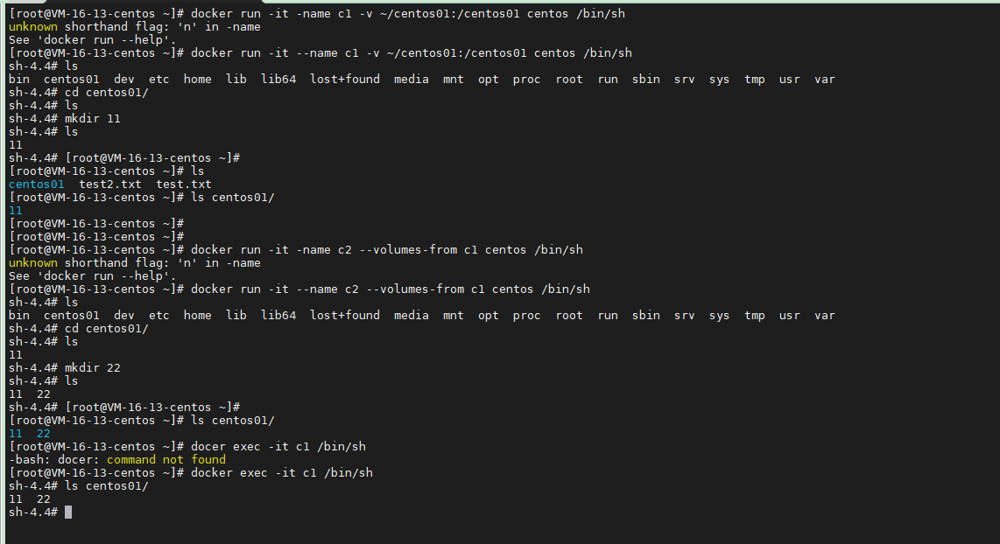

## 安装

官方文档：[https://docs.docker.com/engine/install/centos/](https://docs.docker.com/engine/install/centos/)


```
# 1. 卸载旧版本
sudo yum remove docker \
                  docker-client \
                  docker-client-latest \
                  docker-common \
                  docker-latest \
                  docker-latest-logrotate \
                  docker-logrotate \
                  docker-engine

# 2. 安装前置工具/依赖
sudo yum install -y yum-utils

# 3. 设置镜像仓库
sudo yum-config-manager \
    --add-repo \
    https://download.docker.com/linux/centos/docker-ce.repo

# 3. 使用阿里云镜像
sudo yum-config-manager \
    --add-repo \
    http://mirrors.aliyun.com/docker-ce/linux/centos/docker-ce.repo
    
# 4. 安装最新版docker 
# docker-ce 社区版本，docker-ee 企业版，推荐社区版
sudo yum install docker-ce docker-ce-cli containerd.io docker-compose-plugin

# 4. 安装指定版本docker
# 4.1 列出所有版本可用版本
yum list docker-ce --showduplicates | sort -r

docker-ce.x86_64                3:20.10.9-3.el8                 docker-ce-stable
docker-ce.x86_64                3:20.10.8-3.el8                 docker-ce-stable
docker-ce.x86_64                3:20.10.7-3.el8                 docker-ce-stable
docker-ce.x86_64                3:20.10.6-3.el8                 docker-ce-stable
docker-ce.x86_64                3:20.10.5-3.el8                 docker-ce-stable
docker-ce.x86_64                3:20.10.4-3.el8                 docker-ce-stable
docker-ce.x86_64                3:20.10.3-3.el8                 docker-ce-stable
docker-ce.x86_64                3:20.10.2-3.el8                 docker-ce-stable
docker-ce.x86_64                3:20.10.17-3.el8                docker-ce-stable
docker-ce.x86_64                3:20.10.16-3.el8                docker-ce-stable
docker-ce.x86_64                3:20.10.15-3.el8                docker-ce-stable
docker-ce.x86_64                3:20.10.14-3.el8                docker-ce-stable

# 4.2 安装指定版本
sudo yum install docker-ce-<VERSION_STRING> docker-ce-cli-<VERSION_STRING> containerd.io docker-compose-plugin
# 4.2 选择需要的版本，通过第二列，“：”之后和“-”之前的部分，是版本号（VERSION_STRING）
# 例如安装第一个20.10.9版本
sudo yum install docker-ce-20.10.9 docker-ce-cli-20.10.9 containerd.io docker-compose-plugin

# 5. 启动docker
sudo systemctl start docker

# 6. 查看docker版本信息
docker version

Client: Docker Engine - Community
 Version:           20.10.17
 API version:       1.41
 Go version:        go1.17.11
 Git commit:        100c701
 Built:             Mon Jun  6 23:03:11 2022
 OS/Arch:           linux/amd64
 Context:           default
 Experimental:      true

Server: Docker Engine - Community
 Engine:
  Version:          20.10.17
  API version:      1.41 (minimum version 1.12)
  Go version:       go1.17.11
  Git commit:       a89b842
  Built:            Mon Jun  6 23:01:29 2022
  OS/Arch:          linux/amd64
  Experimental:     false
 containerd:
  Version:          1.6.6
  GitCommit:        10c12954828e7c7c9b6e0ea9b0c02b01407d3ae1
 runc:
  Version:          1.1.2
  GitCommit:        v1.1.2-0-ga916309
 docker-init:
  Version:          0.19.0
  GitCommit:        de40ad0
  
# 7. 使用hello-world测试docker是否按照成功
sudo docker run hello-world

Unable to find image 'hello-world:latest' locally
latest: Pulling from library/hello-world
2db29710123e: Pull complete
Digest: sha256:13e367d31ae85359f42d637adf6da428f76d75dc9afeb3c21faea0d976f5c651
Status: Downloaded newer image for hello-world:latest

Hello from Docker!
This message shows that your installation appears to be working correctly.

To generate this message, Docker took the following steps:
 1. The Docker client contacted the Docker daemon.
 2. The Docker daemon pulled the "hello-world" image from the Docker Hub.
    (amd64)
 3. The Docker daemon created a new container from that image which runs the
    executable that produces the output you are currently reading.
 4. The Docker daemon streamed that output to the Docker client, which sent it
    to your terminal.

To try something more ambitious, you can run an Ubuntu container with:
 $ docker run -it ubuntu bash

Share images, automate workflows, and more with a free Docker ID:
 https://hub.docker.com/

For more examples and ideas, visit:
 https://docs.docker.com/get-started/

```


```
# 查看docker下载的所有镜像
docker images

REPOSITORY    TAG       IMAGE ID       CREATED        SIZE
hello-world   latest    feb5d9fea6a5   9 months ago   13.3kB
```


## 卸载

[https://docs.docker.com/engine/install/centos/#uninstall-docker-engine](https://docs.docker.com/engine/install/centos/#uninstall-docker-engine)


````
# 卸载依赖
sudo yum remove docker-ce docker-ce-cli containerd.io docker-compose-plugin

# 删除目录
sudo rm -rf /var/lib/docker
sudo rm -rf /var/lib/containerd
````


`/var/lib/docker` 是docker的默认工作路径。


## docker run 执行流程

执行`docker run`时，首先会在本地查找镜像是否存在，如果存在，则直接运行。如果不存在，则到远程docker hub上进行下载，如果下载成功，则运行，如果不存在，则报错。


## docker 原理

 Docker 使用客户端-服务器架构。Docker*客户端与 Docker守护进程对话，后者负责构建、运行和分发 Docker 容器的繁重工作 。 Docker 守护程序 ( `dockerd`) 侦听 Docker API 请求并管理 Docker 对象，例如图像、容器、网络和卷。 


Docker 使用一种称为*容器*`namespaces`的技术来提供隔离的工作空间。当您运行容器时，Docker 会为该容器创建一组 *命名空间。*

这些命名空间提供了一层隔离。容器的每个方面都在单独的命名空间中运行，并且它的访问权限仅限于该命名空间。


## docker信息命令

### docker verion

显示docker的基本信息

### docker info

显示docker的系统信息，包括镜像和容器数量等等

```
docker info
Client:
 Context:    default
 Debug Mode: false
 Plugins:
  app: Docker App (Docker Inc., v0.9.1-beta3)
  buildx: Docker Buildx (Docker Inc., v0.8.2-docker)
  compose: Docker Compose (Docker Inc., v2.6.0)
  scan: Docker Scan (Docker Inc., v0.17.0)

Server:
 Containers: 1
  Running: 0
  Paused: 0
  Stopped: 1
 Images: 1
 Server Version: 20.10.17
 Storage Driver: overlay2
  Backing Filesystem: extfs
  Supports d_type: true
  Native Overlay Diff: true
  userxattr: false
 Logging Driver: json-file
 Cgroup Driver: cgroupfs
 Cgroup Version: 1
 Plugins:
  Volume: local
  Network: bridge host ipvlan macvlan null overlay
  Log: awslogs fluentd gcplogs gelf journald json-file local logentries splunk syslog
 Swarm: inactive
 Runtimes: io.containerd.runc.v2 io.containerd.runtime.v1.linux runc
 Default Runtime: runc
 Init Binary: docker-init
 containerd version: 10c12954828e7c7c9b6e0ea9b0c02b01407d3ae1
 runc version: v1.1.2-0-ga916309
 init version: de40ad0
 Security Options:
  seccomp
   Profile: default
 Kernel Version: 4.18.0-305.10.2.el8_4.x86_64
 Operating System: CentOS Linux 8 (Core)
 OSType: linux
 Architecture: x86_64
 CPUs: 2
 Total Memory: 3.649GiB
 Name: VM-16-13-centos
 ID: KFBX:BDVF:ADQ4:AZAB:YA5L:TBQS:Z3I2:JOHA:ITTB:SQDC:E42M:M73J
 Docker Root Dir: /var/lib/docker
 Debug Mode: false
 Registry: https://index.docker.io/v1/
 Labels:
 Experimental: false
 Insecure Registries:
  127.0.0.0/8
 Live Restore Enabled: false
```

### docker  命令 --help

命令文档  [https://docs.docker.com/reference/](https://docs.docker.com/reference/)


## 镜像命令

### docker image

镜像管理

```
docker images

REPOSITORY    TAG       IMAGE ID       CREATED        SIZE
hello-world   latest    feb5d9fea6a5   9 months ago   13.3kB

# REPOSITORY 	镜像的仓库源，容器名称
# TAG			镜像的标签
# IMAGE ID		镜像ID
# CREATED		镜像创建时间
# SIZE			镜像大小
```

```
# 可选性
-a, --all		显示所有镜像
-q, --quiet		仅显示镜像ID
```


### docker search

搜索镜像

网页版镜像仓库地址: [https://hub.docker.com/search](https://hub.docker.com/search)

```
# 所有所有镜像
docker search mysql
NAME	DESCRIPTION                                     STARS     OFFICIAL   AUTOMATED
mysql	MySQL is a widely used, open-source relation…   12851     [OK]
mariadb	MariaDB Server is a high performing open sou…   4926      [OK]

# 可选项
-f, --filter
--format
--limit


# 按条件搜索，STARS大于600 且 是官方仓库
# 两种写法, 多条件使用多个--filter
docker search mysql --filter=stars=600 --filter is-official=true

NAME      DESCRIPTION                                     STARS     OFFICIAL   AUTOMATED
mysql     MySQL is a widely used, open-source relation…   12851     [OK]
mariadb   MariaDB Server is a high performing open sou…   4926      [OK]

# --filter支持三个条件
# stars				收藏数		stars=number
# is-automated		自动化 	is-automated=true/false
# is-official		官方		 is-official=true/false

```


### docker pull

下载镜像

```
# docker pull 镜像名[:tag]
docker pull mysql
Using default tag: latest			# 如果不写tag，默认是latest
latest: Pulling from library/mysql	# 分层下载，联合文件系统，docker image核心
e54b73e95ef3: Pull complete
bb429e544310: Pull complete
c148b3f9047c: Pull complete
a1dd213a3236: Pull complete
297095d1476d: Pull complete
87f3aa837301: Pull complete
535019436481: Pull complete
23722cff1cc3: Pull complete
eb19883dc4c6: Pull complete
6eaa2c236095: Pull complete
Digest: sha256:444f037733d01fc3dfc691a9ab05e346629e8e4d3a6c75da864f21421fb38ced	# 签名
Status: Downloaded newer image for mysql:latest
docker.io/library/mysql:latest		#docker image 真实地址

# 以下两个命令等价
docker pull mysql
docker pull docker.io/library/mysql:latest
```


### docker rmi

删除镜像

```
docker rmi -f hello-world

Untagged: hello-world:latest
Untagged: hello-world@sha256:13e367d31ae85359f42d637adf6da428f76d75dc9afeb3c21faea0d976f5c651
Deleted: sha256:feb5d9fea6a5e9606aa995e879d862b825965ba48de054caab5ef356dc6b3412

docker rmi -f image_id[:tag]		# 删除指定镜像
docker rmi - f image_id image_id 	# 删除多个镜像
```


## 容器命令

有镜像才能创建容器


### 新建容器并启动 docker run

```
docker run [参数] image

# 参数说明
--name="容器名称"	容器名字，启动容器的名称，便于区分
-d					后台运行
-it					使用交互方式运行,进入容器内容查看内容
-p 					指定容器端口 -p 8080:80
	-p ip:主机端口:容器端口
	-p 主机端口:容器端口(最常用)
	-p 容器端口
-P					随机指定端口
```


```
# cmd 下启动cenos
docker run -it centos /bin/sh
[root@5dda638536fa /]#

# centos 下启动centos
docker run -it centos /bin/bash
[root@5dda638536fa /]#

# exit停止容器并退出容器
[root@5dda638536fa /]# exit
# ctrl + P + Q 不停止容器 退出容器
```


### docker ps

列出运行的容器


```
# docker ps [可选参数]

# 列出正在运行的容器
docker ps

CONTAINER ID   IMAGE     COMMAND                  CREATED         STATUS         PORTS                  NAMES
113ffb59a550   nginx     "/docker-entrypoint.…"   6 minutes ago   Up 6 minutes   0.0.0.0:8080->80/tcp   nginx-01

# CONTAINER ID 	容器ID
# IMAGE			镜像名称
# COMMAND		启动命令
# CREATED		容器创建时间
# STATUS		运行状态
# PORTS			端口映射情况
# NAMES			容器名称

# 列出所有容器，包括已经停止的
docker ps -a

# 根据名称模糊搜索
docker ps -a --filter "name=ng"

# 根据容器ID模糊搜索
docker ps -a --filter "id=cca"

# 可选参数
-a						全部
-n num					最近创建的几条
-l						最后创建的一条
-q						只显示ID
-s						显示size大小
--no-trunc				显示明细信息， don't truncate output 不截断输出
-f, --filter			过滤条件 -f "key=value"
	id
	name
	label
	status				One of created, restarting, running, removing, paused, exited, or dead
	
```


### docker rm

删除容器

```
# 删除指定容器
docker rm bfb2710c293d

# 删除所有不在运行的容器
docker rm $(docker ps -aq -f "status=exited")
# 等价于
docker ps -aq -f "status=exited" | xargs docker rm

# 可选参数
-f				强制删除正在运行的容器
```


### docker start/restart

启动容器

```
# 启动容器
docker start 84480543d8cd

# 重启容器，重启时间间隔2秒
docker restart -t 10 84480543d8cd
```


### docker stop/kill

停止容器


```
# 优雅退出容器
docker stop 84480543d8cd

# 强制退出容器
docker kill 84480543d8cd
```


## 常用命令

### 后台启动容器 docker run 

```
# 使用-d指令后台启动
docker run -d centos

# 该命令存在问题，通过docker ps 发现容器被停止了
# docker容器使用后台运行时，必须要有一个前台进程，如果没有就会自动停止，该方式就缺乏前台进程导致启动后自动停止

# 使用-it保持容器后台运行
docker run --name centos-03 -d  -it centos /bin/sh
```


### 查看日志 docker logs

```
# 监听容器日志
docker logs -tf 9164f68ea536

# 输出指定时间之后的日志
docker logs --since 2022-07-12T08:15:04.719814800Z 9164f68ea536

# 可选参数
-f					监听日志输出
-n, --tail			输出最后N行日志
-t, --timestamps	显示时间戳，每一行日志前输出时间戳信息
-since				输出指定时间之后的日志
-until				输出指定时间之前的日志
```


### 查看容器进程 docker top

```
docker top 9164f68ea536
UID		PID		PPID	C	STIME	TTY		TIME		CMD
root	3529	3509	0	08:15	?		00:00:00	/bin/sh
```


### 查看容器元数据 docker inspect

```
# 查看容器元数据
docker inspect 9164f68ea536
```


### 进入容器 docker exec/attach

```
# 方式一
# 新建一个命令行并进入
docker exec -it 容器ID bashShell

docker exec -it 9164f68ea536 /bin/bash

# 方式二
# 进入正在运行的命令行
docker attach 容器ID

docker attach 9164f68ea536

```


### 拷贝命令 docker copy


```
# 复制容器文件到本地
docker cp 容器:路径 本机路径

# 复制本地文件到容器
docker cp 本机路径 容器:路径

# 在centos中新建一个文件
docker exec -it -w ~ centos-01 touch /tmp/test.txt
# 拷贝容器文件到当前目录
docker cp centos-01:/tmp/test.txt ./

# 本地新建文件并复制到容器
echo "test" >> test2.txt; docker cp ./test2.txt centos-01:/tmp/
# 查看容器内目录
docker exec -it centos-01 ls /tmp
test.txt  test2.txt
```


## 联合文件系统


## commit 镜像

将一个容器生成一个新的镜像

```
docker commit 可选参数 容器ID 镜像名称[:tag]

# 将一个容器生成一个本地镜像
docker commit -a caoruiy -m "test helloworld" c4af83c1f703 hello-world-cr:v1.0.0
```


## 容器数据卷

使用容器时，希望容器之间有一个数据共享的技术，Docker中产生的数据，可以同步到本地。可以将容器内的数据，挂载到本地。

这是一个容器数据持久化和同步的操作，使得容器间可以数据共享。

### 使用方式一 -v

```
docker run -it -v 主机目录:容器目录 镜像 交互命令

# 挂载的形式启动容器
# 修改容器内容的文件，在主机上修改文件，两边均会同步
# 如果容器停止，在本地上修改文件内容，启动容器后，容器内也会进行同步
docker run -it -v /c/Users/Lenovo/Desktop/centos:/home centos /bin/bash
# 容器内部操作文件
[root@6b77aeb1d6de home]# cd /home
[root@6b77aeb1d6de home]# mkdir test

# 退出容器
ctrl + p + q

# 列出本地目录内容
ls /c/Users/Lenovo/Desktop/centos
test
```

#### 具名挂载和匿名挂载

```
# 匿名挂载，挂载容器内的目录时，不指定具体的本地地址，本地卷名称
docker run -it -v 容器目录 镜像 交互命令

# 匿名挂载一个卷
docker run -d -it -v /home centos /bin/sh

# 查看docker 卷
docker volume ls

DRIVER    VOLUME NAME
local     12d96dec13ff04dcc58d060d00bb01fcc3128102476160a8d79c0fa815de14b9
```


```
# 具名挂载，挂载容器内的目录时，指定一个卷名称
# 卷名称就是一个字符串,不是一个 / 或者 ./ 的路径地址
docker run -it -v 卷名称:容器目录 镜像 交互命令

# 具名挂载
docker run -d -it -v juming-cento:/home centos /bin/sh

# 查看docker 卷
docker volume ls

DRIVER    VOLUME NAME
local     12d96dec13ff04dcc58d060d00bb01fcc3128102476160a8d79c0fa815de14b9
local     juming-cento
```


匿名挂载和具名挂载，具体的挂载目录到底在哪里？

```
# 查看docker元信息
docker inspect 433938cde9c0

# 具名挂载时挂载信息输出
"Mounts": [
  {
      "Type": "volume", // 类型,挂载
      "Name": "juming-cento", // 挂载名称
      "Source": "/var/lib/docker/volumes/juming-cento/_data", // 具体的本机挂载地址
      "Destination": "/home", // 容器内地址
      "Driver": "local",
      "Mode": "z",
      "RW": true,
      "Propagation": ""
  }
]

# 匿名挂载时挂载信息输出
"Mounts": [
    {
        "Type": "volume",
        "Name": "12d96dec13ff04dcc58d060d00bb01fcc3128102476160a8d79c0fa815de14b9",
        "Source": "/var/lib/docker/volumes/12d96dec13ff04dcc58d060d00bb01fcc3128102476160a8d79c0fa815de14b9/_data",
        "Destination": "/home",
        "Driver": "local",
        "Mode": "",
        "RW": true,
        "Propagation": ""
    }
]

# 加载点都在 /var/lib/docker/volumes/xxx/_data目录下

```


### 使用方式二 DockerFile

DockerFile是用来构建docker镜像的一个构建文件。脚本。

[https://docs.docker.com/engine/reference/builder/](https://docs.docker.com/engine/reference/builder/)


# 数据卷容器

为了实现多个容器之间的数据共享，最好的方式就是让多个容器挂载到一个目录地址作为数据卷。所谓的数据卷容器，就是作为存放数据的容器，其他容器加载到该容器上，实现数据共享。

`--volumes-from` 参数，可以从引用的容器中，挂载所有自定义的卷，需要注意的是“自定义的卷”。


```
# 首先启动一个容器，并挂载一个卷
docker run -it -name c1 -v ~/centos01:/centos01 centos /bin/sh

# 在容器c1 centos01卷内新建一个目录11
sh-4.4# cd centos01/
sh-4.4# ls
sh-4.4# mkdir 11
sh-4.4# ls
11

# 退出容器，在本地目录centos01中发现相同内容，挂载成功
[root@VM-16-13-centos ~]# ls
centos01  test2.txt  test.txt
[root@VM-16-13-centos ~]# ls centos01/
11

# 新建容器c2，c1作为数据卷容器
docker run -it --name c2 --volumes-from c1 centos /bin/sh

# 查看容器内挂载数据
sh-4.4# cd centos01/
sh-4.4# ls
11

# 在容器c2中centos01卷下，新建文件夹22
sh-4.4# mkdir 22
sh-4.4# ls
11  22

# 退出容器，查看本地数据
[root@VM-16-13-centos ~]# ls centos01/
11  22

# 进入容器c1 查看数据
[root@VM-16-13-centos ~]# docker exec -it c1 /bin/sh
sh-4.4# ls centos01/
11  22

```



删除数据卷容器c1，数据也不会丢失。**共享卷实际是一个备份的概念。**

```
# 查看本地容器，一共有c1 c2两个容器
[root@VM-16-13-centos ~]# docker ps
CONTAINER ID   IMAGE     COMMAND     CREATED         STATUS         PORTS     NAMES
cfe02ba04ad7   centos    "/bin/sh"   5 minutes ago   Up 5 minutes             c2
f7d563151f92   centos    "/bin/sh"   6 minutes ago   Up 6 minutes             c1

# 强制删除数据卷容器c1
[root@VM-16-13-centos ~]# docker rm -f c1
c1

[root@VM-16-13-centos ~]# docker ps
CONTAINER ID   IMAGE     COMMAND     CREATED         STATUS         PORTS     NAMES
cfe02ba04ad7   centos    "/bin/sh"   5 minutes ago   Up 5 minutes             c2

# 查看本地目录数据依然存在
[root@VM-16-13-centos ~]# ls centos01/
11  22

# 容器c2中的数据依然存在
[root@VM-16-13-centos ~]# docker exec -it c2 /bin/sh
sh-4.4# ls centos01/
11  22

# 在容器c2中创建新目录33
sh-4.4# mkdir centos01/33
sh-4.4# ls centos01/
11  22  33
sh-4.4# read escape sequence

# 退出容器后，查看本地目录，数据依然同步
[root@VM-16-13-centos ~]# ls centos01/
11  22  33
```

数据卷容器可以做多个容器之间的数据共享，**数据卷的生命周期直到没有容器使用为止**。所以删除任意一个容器不影响数据卷的信息共享。


# docker build

从Dockerfile构建镜像

```
docker build [可选项] 向下文目录

# 可选项
-f, --file 		#Dockerfile的名称，不指定是默认是当前文件夹的Dickerfile文件
-t, --tag 
```


# .dockerignore

排除部分构建文件，防止将大文件或者敏感文件添加到构建上下文中。

每行一个目录或者文件地址，支持形式有

```
# comment			注释信息
temp?				排除根目录名称以temp开头的,后接单个字符的目录或文件, 如: /tempa
*/temp*				排除以temp开头的子目录或文件，如: /a/tempFile.txt  /a/tempDir
*/*/temp*			排除以temp开头的两级子目录或文件，如: /a/b/tempFile.txt  /a/b/tempDir
**/tmp*				排除所有目录中的以temp开头的目录或文件
!temp*				!表示排除例外，表示剔除根目录下以temp开头的目录或文件。
```

基本原则为`?`匹配单个字符；`*`匹配多个字符。

```
# 以下写法的含义表示保留除了根目录下的以以temp开头的目录或文件外的，所有层级下的以temp开头的目录或文件
**/tmp*
!temp*

# 示例: 除了/tempa 其他文件均会被剔除
/tempa
/tempb/a
/a/tempc
/a/b/tempd
```


# DockerFile

docker file是用来构建docker镜像的文件，是一个命令脚本文件。

构建镜像的步骤：

1. 编写dockerfile文件
2. 使用docker build 构建一个镜像
3. 使用docker run运行进行
4. 使用docker push 发布镜像

## dockerFile指令

```
ARG			# 定义变量，提供给FROM使用
FROM 		# 基础镜像，镜像构建开始位置
MAINTAINER	# 负责人，姓名+邮箱
RUN			# 进行构建时需要执行的命令
ADD			# 复制文件，往镜像中添加内容
WORKDIR		# 设置镜像的工作目录
VOLUME		# 挂载目录
EXPOST		# 对外暴露的端口
RUN			#
CMD			# 指定容器启动时候要运行的命令，相当于为容器执行提供默认值。只有最后一个会生效，可以被替代
ENTRYPOINT	# 指定容器启动时候要运行的命令，不可替代，可以追加
ONBUILD		# 
COPY		# 类似ADD，拷贝内容到镜像中
ENV			# 构建时设置环境变量

```

## RUN

```
# 该命令支持两种写法，shell和exec，
# shell形式将改变默认的shell，linux下默认是/bin/sh -c，window下默认是cmd /S /C
# exec形式，因为可以避免shell字符串修改
# RUN <command>									# shell形式
# RUN ["executable", "param1", "param2"]		# exec形式

# 可以使用\符号进行命令换行书写
RUN /bin/sh -c 'cd /home; \
ls -al'
# 等价于
RUM /bin/sh -c 'cd /home; ls -al'


# 如果需要使用其他shell, 请使用exec形式
# exec形式被解析为 JSON 数组，这意味着您必须在单词周围使用双引号 (") 而不是单引号 (')
RUN ["/bin/bash", "-c", "cd /home", "ls -al"]
```

> exec形式被解析为 JSON 数组，这意味着您必须在单词周围使用双引号 (") 而不是单引号 (')


> exec模式，不是直接调用命令，所以不会引用shell脚本命令，如果你希望启动时使用shell，可以明确指定hell。就像这样：RUN ["/bin/bash", "-c", "cd /home", "ls -al"]


基于centos制作自己的镜像

```
mkdir my-centos
cd my-centos
vim Dockerfile
```
编写Dockerfile文件

```
FROM centos
RUN sed -i 's/mirrorlist/#mirrorlist/g' /etc/yum.repos.d/CentOS-*
RUN sed -i 's|#baseurl=http://mirror.centos.org|baseurl=http://vault.centos.org|g' /etc/yum.repos.d/CentOS-*
RUN yum clear
RUN yum makecache
RUN yum -y install wget
RUN echo '---------------------over--------------------'
```
生成镜像
```
docekr build -t my-centyos .
```
```
# 运行镜像
docker run -it --name mc1 my-centos /bin/sh
# 容器内执行,已经包含wget命令
[root@8d8302624841 /]# wget
wget: missing URL
Usage: wget [OPTION]... [URL]...

Try `wget --help' for more options.

```


## CMD 和 ENTRYPOINT的区别

CMD是执行运行的默认命令，当镜像运行时不指定任何命令时，默认的CMD命令会被执行，该指令可以在运行时被替换。

### CMD制作镜像

```
FROM centos
RUN echo 'This is a test image'
CMD ls -a
```


```
# 编译生成镜像
docker build -t my-centos .

# 运行时不指定默认命令，将执行  ls -a
docker run -it my-centos
.   .dockerenv  dev  home  lib64       media  opt   root  sbin  sys  usr
..  bin         etc  lib   lost+found  mnt    proc  run   srv   tmp  var

# 运行时指定默认命令，执行信息被新命令覆盖
[root@VM-16-13-centos my-centos]# docker run -it my-centos ls -al
total 56
drwxr-xr-x   1 root root 4096 Jul 14 06:28 .
drwxr-xr-x   1 root root 4096 Jul 14 06:28 ..
-rwxr-xr-x   1 root root    0 Jul 14 06:28 .dockerenv
lrwxrwxrwx   1 root root    7 Nov  3  2020 bin -> usr/bin
drwxr-xr-x   5 root root  360 Jul 14 06:28 dev
drwxr-xr-x   1 root root 4096 Jul 14 06:28 etc
drwxr-xr-x   2 root root 4096 Nov  3  2020 home
lrwxrwxrwx   1 root root    7 Nov  3  2020 lib -> usr/lib
lrwxrwxrwx   1 root root    9 Nov  3  2020 lib64 -> usr/lib64
drwx------   2 root root 4096 Sep 15  2021 lost+found
drwxr-xr-x   2 root root 4096 Nov  3  2020 media
drwxr-xr-x   2 root root 4096 Nov  3  2020 mnt
drwxr-xr-x   2 root root 4096 Nov  3  2020 opt
dr-xr-xr-x 129 root root    0 Jul 14 06:28 proc
dr-xr-x---   2 root root 4096 Sep 15  2021 root
drwxr-xr-x  11 root root 4096 Sep 15  2021 run
lrwxrwxrwx   1 root root    8 Nov  3  2020 sbin -> usr/sbin
drwxr-xr-x   2 root root 4096 Nov  3  2020 srv
dr-xr-xr-x  13 root root    0 Jul 14 06:28 sys
drwxrwxrwt   7 root root 4096 Sep 15  2021 tmp
drwxr-xr-x  12 root root 4096 Sep 15  2021 usr
drwxr-xr-x  20 root root 4096 Sep 15  2021 var
```


### ENTRYPOINT制作镜像

```
FROM centos
RUN echo 'This is a test image'
ENTRYPOINT ["ls", "-a"]
```

值得注意的是，此处的ENTRYPOINT写法是采用exec形式（[命令，参数，参数]）（ENTRYPOINT ["ls", "-a"]）只有该形式，在运行镜像时才能追加参数。

如果采用shell命令形式（ENTRYPOINT 字符串）（ENTRYPOINT ls -a），他将在` /bin/sh -c `中执行，并会忽略docker run时的命令参数


exec 形式不会调用shell命令，这就意味着，使用该命令时，你无法通过命令行外壳进入容器，如想使用shell处理，可以这么写` ENTRYPOINT [ "sh", "-c", "ls -a" ] `

```
# 生成镜像
docker build -t entrypoint-centos .

# 运行,默认命令
docker run -it --name ec1 entrypoint-centos
.   .dockerenv  dev  home  lib64       media  opt   root  sbin  sys  usr
..  bin         etc  lib   lost+found  mnt    proc  run   srv   tmp  var

# 运行,使用默认命令,追加参数
docker run -it --name ec2 entrypoint-centos -l
total 56
drwxr-xr-x   1 root root 4096 Jul 14 06:43 .
drwxr-xr-x   1 root root 4096 Jul 14 06:43 ..
-rwxr-xr-x   1 root root    0 Jul 14 06:43 .dockerenv
lrwxrwxrwx   1 root root    7 Nov  3  2020 bin -> usr/bin
drwxr-xr-x   5 root root  360 Jul 14 06:43 dev
drwxr-xr-x   1 root root 4096 Jul 14 06:43 etc
drwxr-xr-x   2 root root 4096 Nov  3  2020 home
lrwxrwxrwx   1 root root    7 Nov  3  2020 lib -> usr/lib
lrwxrwxrwx   1 root root    9 Nov  3  2020 lib64 -> usr/lib64
drwx------   2 root root 4096 Sep 15  2021 lost+found
drwxr-xr-x   2 root root 4096 Nov  3  2020 media
drwxr-xr-x   2 root root 4096 Nov  3  2020 mnt
drwxr-xr-x   2 root root 4096 Nov  3  2020 opt
dr-xr-xr-x 126 root root    0 Jul 14 06:43 proc
dr-xr-x---   2 root root 4096 Sep 15  2021 root
drwxr-xr-x  11 root root 4096 Sep 15  2021 run
lrwxrwxrwx   1 root root    8 Nov  3  2020 sbin -> usr/sbin
drwxr-xr-x   2 root root 4096 Nov  3  2020 srv
dr-xr-xr-x  13 root root    0 Jul 14 06:43 sys
drwxrwxrwt   7 root root 4096 Sep 15  2021 tmp
drwxr-xr-x  12 root root 4096 Sep 15  2021 usr
drwxr-xr-x  20 root root 4096 Sep 15  2021 var
```


### shell形式的ENTRYPOINT

如果指定字符串形式的命令，该命令会在` /bin/sh -c `内执行，并会忽略命令行中的参数

```
FROM centos
RUN echo 'This is a test image'
ENTRYPOINT ls -a
```


```
# 运行,默认命令
docker run -it --name ec1 entrypoint-centos
.   .dockerenv  dev  home  lib64       media  opt   root  sbin  sys  usr
..  bin         etc  lib   lost+found  mnt    proc  run   srv   tmp  var

# 运行,使用默认命令,追加参数
docker run -it --name ec2 entrypoint-centos -l
.   .dockerenv  dev  home  lib64       media  opt   root  sbin  sys  usr
..  bin         etc  lib   lost+found  mnt    proc  run   srv   tmp  var
```


