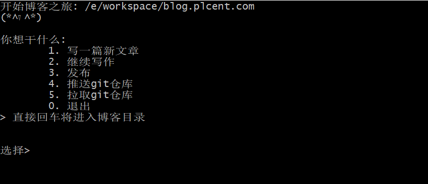
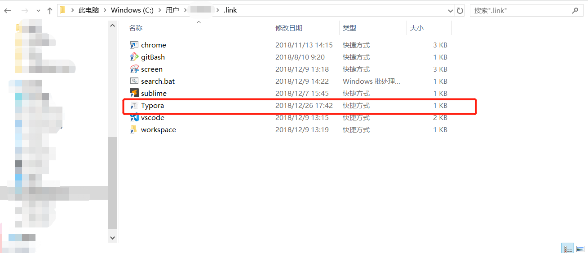

## 为何要写这样一个脚本

每次想写博客时，都需要打开编辑器，新建文件，录入文件名称，或者 `cd` 到博客目录，`hexo create xxxx` ，打开编辑器，一通操作，从我想写博客到开始写，已经一分钟过去了。

所有我在想，有没有一个办法，能让我在3秒钟之内，就能开始写博客。（创作的心情就是这么迫切，哈哈哈哈）


最终，决定手写了一个命令行脚本，解决我的小需求。写博客时，只要双击脚本，everything is ready!

所有当我想写博客时，我就可以这样做：


我要做的只是输入文章的名字，其他的所有都交给脚本去执行。

为了方便使用，我设置了一下五个功能：



> 脚本代码附在文章最后，你也可以手动从此下载，然后对照修改相关配置
>
>  [blog.sh](so-simple-to-write-blog\blog.sh) 


## 参数修改

在脚本的第四行#L4，你需要根据你本地仓库的位置，手动修改文件路径地址

```shell
#!/usr/bin/bash

# 博客地址
# ***** 修改为你本地的博客仓库地址 *****
export blogPath=/e/workspace/blog.plcent.com
# 文章地址
# 改地址不用修改
export writePath=/source/_posts/
echo "开始博客之旅: $blogPath"
echo -e "(*^▽^*)\n"
```

## 相关命令设置
因为脚本中直接使用了 `hexo` 、`Typora` 命令，需要先安装/创建相关命令

1. 安装 `hexo`

```
npm install  hexo -g
```

2. 安装 `Typora`  >>> [下载Typora](https://www.typora.io/)

   `Typora` 的优势就不用我都说了，美观的界面，支持添加图片时自动复制图片到对应文章目录下等等....

3. 将`Typora`设为全局命令

   - 找到你的安装路径，`Typora.exe` 运行程序右键创建快捷方式 

   - 将快捷方式复制到 `C:\Users\你的计算机用户名\.link` 下，没有`.link` 目录的手动创建一个。然后重命名为 `Typora`

   - windows10 : `开始` - `设置` - `主页` - `系统` - `关于` - `系统信息` - `高级环境变量` - `环境变量` 将 `C:\Users\你的计算机用户名\.link` 地址添加到系统环境变量 `PATH` 中。其他系统自行设置。


此时应该可以在命令行使用 `hexo` 和  `Typora` 命令了

   

   

   


##  功能介绍

### 写一篇新文章

该选项会让你输入文件名称，使用你录入的名称，利用hexo命令创建一篇博客，之后会打开Typora

这要求你需要全局按照了`hexo`命令，并将Typora设为全局命令


### 继续写作

该选项会直接打开Typora，你可以手动选择之前写过的一篇文章，接着书写


### 发布

编写完文章之后，你需要调用hexo的发布命令，自动编译好文章，你要做的就是选择`3`，然后等待。该步骤的所有操作其实就和你手动执行hexo发布命令一样。

```shell
clear
echo "发布站点"
echo "1. 正在清除博客信息..."
hexo clean
echo "2. 正在生成博客内容..."
hexo g
echo "3. 正在发布博客.."
hexo d
```

> 如果你想你的博客可以自动推送更新，可以参照我写的另外两篇文章：
> [hexo搭建个人博客并部署到个人服务器](https://blog.plcent.com/2019/11/04/hello-hexo/)
> [如果优雅的部署hexo博客到自己的服务器](https://blog.plcent.com/2019/11/08/how-to-deploy-hexo-to-self-server/)


### 推送git仓库

该部分模拟了手动提交仓库的操作，需要你录入一个提交日志


```shell
clear
read -p "推送日志> " commitMsg
# 如果你没有录入日志信息，使用当前日期作为日志推送
if [[ -n commitMsg ]]; then
  commitDate=`date "+%Y/%m/%d"`
  commitMsg="更新博客-$commitDate"
fi
echo "推送代码到git仓库"
echo $commitMsg
git add .
git commit -m "$commitMsg"
git push
```


### 拉取仓库

该部分只执行了 `git pull`命令而已

```shell
echo "拉取仓库..."

cd "$blogPath"
git pull
```


### 进入仓库目录

双击运行脚本后，你可以不输入任何内容，直接回车，命令行脚本将自动跳转到仓库目录，如果脚本功能不能满足你的要求，你可以手动进入命令，执行你需要的命令。


## 脚本源码

```shell
#!/usr/bin/bash

# 博客地址
export blogPath=/e/workspace/blog.plcent.com
# 文章地址
export writePath=/source/_posts/
echo "开始博客之旅: $blogPath"
echo -e "(*^▽^*)\n"

# 进入指定文件夹
cd "$blogPath"


# 输出错误信息
echoError() {
  echo "  --------------------------------"
  echo "    $1"
  echo "  --------------------------------"
}

# 输入任意键退出
pauseAnyKeyExit(){
  read -p '输入任意键退出(输入0返回主菜单)...' key
  if [[ $key = '0' ]]; then
    # 返回主选择
    main
  fi
}

# 打开Typora编辑器
openTypora(){
  echo "打开Typora编辑器"
  start Typora "$blogPath$writePath"
}

# 打开新git bash窗口
openNewGitBash(){
  echo "启动新git bash"
  start gitBash --cd="$blogPath"
}

# 是否当前文章已经存在
isExitPaper() {
  # 博客目录下当前博客是否存在
  return $(-e "$blogPath$writePath$1.md")
}


# ------------------------------------------------------------

# 1. 新写一篇文章
writeNewPost() {
  clear
  read -p "写篇什么> " name

  if [[ $name = '0' ]]; then
    # 返回主选择
    main
  elif [[ -n $name ]]; then
    echo "新建文章: $name.md"
    hexo new post "$name"
    #打开编辑器
    openTypora
  else
    # 错误提示
    echoError "请输入文章名称。(退出请输入0)"
    # 重新执行
    writeNewPost
  fi
}

# 2. 继续写作
continueWrite() {
  clear
  echo "正在打开编辑器Typora"
  # 打开编辑器
  openTypora
  echo "开始书写博客吧..."
}

# 3. 发布站点
displayWebsite(){
  clear
  echo "发布站点"
  echo "1. 正在清除博客信息..."
  echo "> hexo clean"
  hexo clean
  echo "2. 正在生成博客内容..."
  echo "> hexo g"
  hexo g
  echo "3. 正在发布博客.."
  echo "> hexo d"
  hexo d
  
  pauseAnyKeyExit
}

# 4. 推送代码到git仓库
gitPush(){
  clear
  read -p "推送日志> " commitMsg
  if [[ -z $commitMsg ]]; then
    commitDate=`date "+%Y/%m/%d"`
    commitMsg="更新博客-$commitDate"
  fi
  echo "推送代码到git仓库"
  echo "推送日志> $commitMsg"
  echo "> git add ."
  git add .
  echo "> git commit -m $commitMsg"
  git commit -m "$commitMsg"
  echo "> git push"
  git push

  pauseAnyKeyExit
}

# 5. 拉取仓库
gitPull() {
echo "拉取仓库..."

cd "$blogPath"
git pull

pauseAnyKeyExit
}


# 入口
main(){
  # 选择操作类型
  echo "你想干什么:"
  echo -e "\t1. 写一篇新文章"
  echo -e "\t2. 继续写作"
  echo -e "\t3. 发布"
  echo -e "\t4. 推送git仓库"
  echo -e "\t5. 拉取git仓库"
  echo -e "\t0. 退出"
  echo -e "> 直接回车将进入博客目录"
  echo -e "\n"
  read -p "选择> " choose

  
  #开始写作
  if [[ $choose = '1' ]]; then
    writeNewPost 
  elif [[ $choose = '2' ]]; then
    continueWrite
  elif [[ $choose = '3' ]]; then
    displayWebsite
  elif [[ $choose = '4' ]]; then
    gitPush
  elif [[ $choose = '5' ]]; then
    gitPull
  elif [[ $choose = '0' ]]; then
    exit
  elif [ -n $choose ]; then
    # 打开一个新的git bash
    openNewGitBash
  else
    echoError "选择有误，请重新选择。"
    # 继续选择
    main
  fi
}

# 开始执行
main
```

