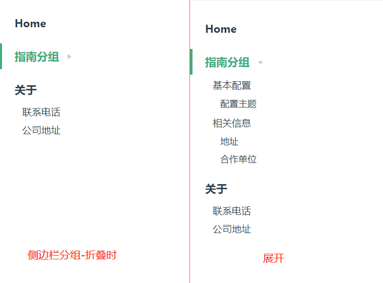

官方文档参见：[默认主题配置](https://vuepress.vuejs.org/zh/theme/default-theme-config.html#首页)


开始之前假设你建立了以下结构的文件内容，之后的设置也会参照这份文件内容
```
.
├── docs
│   ├── .vuepress
|	|	└── config.js (配置文件)
|	|
│   ├── guide (指南)
│   │   ├── README.md (指南首页)
│   │   ├── basic-config (基本配置)
│   │   │   └── README.vue (基本配置首页)
│   │   └── info.md (相关信息页面)
│   │ 
│   ├── about.md (关于我们)
│   └── README.md (项目主页)
│ 
└── package.json

```


# 导航栏


# 侧边栏

配置项 `themeConfig.sidebar`

侧边栏默认是一个包含了多个链接的数组，数组中的每一个真实存在的文件路径。按照上面的目录结构，你想建立相应的侧边栏，你可以如下设置`themeConfig.sidebar`
```json
{
  "themeConfig": {
    sidebar: [
      '/',
      '/guide/',
      '/guide/basic-config/',
      '/guide/info',
      '/about',
    ]
  }
}
```

效果如下：


> 侧边栏的结构和文件实际的目录结构没有关系，侧边栏信息根据`themeConfig.sidebar`参数内容生成。

特别需要注意的是，文件和文件夹的设置方式的差别：

> 文档中说：你可以省略 `.md` 拓展名，同时以 `/` 结尾的路径将会被视为 `*/README.md`

这句话你可以理解成：针对于文件夹，请设置以 `/` 结尾。

如果侧边栏路径指向一个实际的文件，例如`about.md`文件，侧边栏你可以设置成`/about`，他将实际使用 `/about.md`文件，将生成`http:localhost:8000/about.html`页面路径。

如果是一个目录，例如`guide`，请设置成`/guide/`，他将实际使用 `/guide/README.md`文件，将生成`http:localhost:8000/guide/`


## 侧边栏名称

默认情况下，侧边栏将自动提取文件内第一个标题作为导航标题，无论当前标题是第几级标题，如果你想指定标题名称，请使用一个格式为 `[link, text]` 的数组。


## 侧边栏层级深度

类似于官网中的侧边栏信息，他存在一定的层级深度。


默认情况下，侧边栏会自动地显示由当前页面的标题（headers）组成的链接，并按照页面本身的结构进行嵌套。

```markdown
# 一级标题
内容部分

## 二级标题
内容部分

### 三级标题
内容部分

```


默认情况下，层级深度只展示到二级标题，但是你可通过`themeConfig.sidebarDepth`属性修改默认行为。

`0`：禁用标题链接，只提取`h1`的标题；

`1`：默认值，他将提取到`h1`、`h2`的标题；

`2`：最大值，将提取`h1`、`h2`、`h3`的标题。


设置方式有两种：

1. 在`themeConfig.sidebarDepth`设置，他将影响所有页面的侧边栏层级。

2. 在文件中使用`YAML`格式设置，将单独影响当前页面：

   ```markdown
   ---
   sidebarDepth: 2
   ---
   ```

## 显示所有页面的标题链接

默认情况下，侧边栏只会显示由当前活动页面的标题（headers）组成的链接，你可以将 `themeConfig.displayAllHeaders` 设置为 `true` 来显示所有页面的标题链接：

```js
module.exports = {
  themeConfig: {
    displayAllHeaders: true // 默认值：false
  }
}
```

> 设置该属性，所有侧边栏的所有菜单均会展开，否则，只将展开当前获得菜单。


## 侧边栏分组

分组是将在同一个组内的菜单生成一个折叠的菜单，如果将上例中的侧边栏修改为：

```json
{
  "themeConfig": {
    sidebar: [
      "/",
      {
        title: "指南分组",  // 必须的
        path: "/guide/",   // 可选的, 应该是一个绝对路径
        collapsable: true, // 可选的, 是否可折叠，默认值是 true，为false时该分组将永远都是展开状态
        sidebarDepth: 2,   // 可选的, 默认值是 1
        children: ["/guide/basic-config/", "/guide/info"] // 可选的，没有时将不会有折叠效果
      },

      "/about"
    ]
  }
}
```

他将生成如下的侧边栏：



## 多个侧边栏

如果你想为不同的页面组来显示不同的侧边栏，你可以如下设置：

```
{
  "themeConfig": {
    sidebar: {
      '/guide/': [
        '',
        'basic-config/',
        'info'
      ],
      "/": [
        '',
        'about'
      ],
    }
  }
}
```


>需要注意的是:
>
>`sidebar`属性是一个键值对对象，而不是数组。
>
>`/` 路径必须要在最后设置，`vuepress`会按顺序遍历侧边栏配置来寻找匹配的配置，如果先配置`/`，会导致之后的配置均无法找到，因为`/`可以匹配到任意模式。

